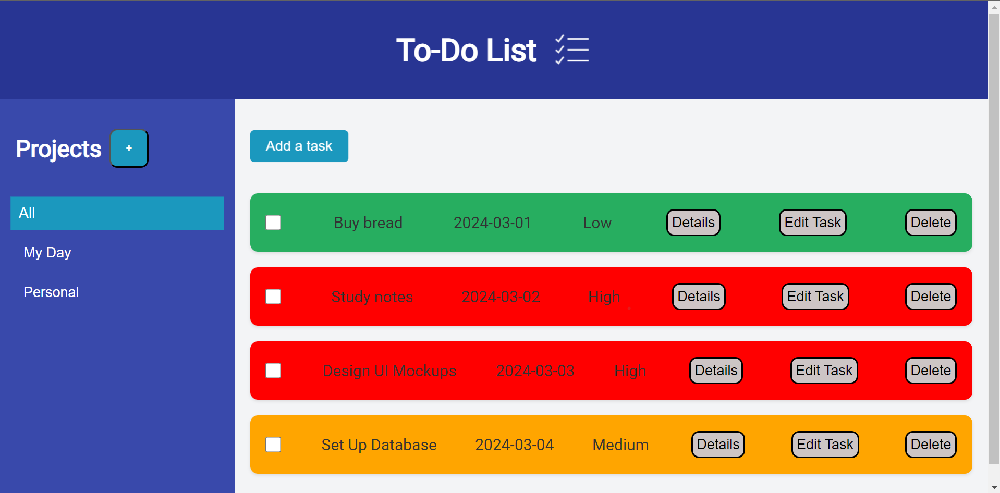

# To-Do List Application

A simple and efficient To-Do List application built using Vite. This application allows users to manage their tasks by adding, editing, deleting, and marking tasks as complete. The tasks are saved in the browser's `localStorage`, ensuring persistence across page reloads.

## Features

- Add new tasks with details like name, description, due date, and priority.
- Edit existing tasks.
- Delete tasks.
- Mark tasks as complete with a strike-through.
- Highlight and select different projects.
- Persistence of tasks using `localStorage`.

## Live Link
https://rushil-todo-list.netlify.app/

## Demo



## Installation

### Prerequisites

Before you begin, ensure you have the following installed on your system:

- [Node.js](https://nodejs.org/en/) (v12 or later)
- [npm](https://www.npmjs.com/) (v6 or later) or [Yarn](https://yarnpkg.com/)

### Steps

1. **Clone the Repository**

    ```sh
    git clone https://github.com/yourusername/todo-list.git
    cd todo-list
    ```

2. **Install Dependencies**

    If you're using npm:

    ```sh
    npm install
    ```

    Or if you're using Yarn:

    ```sh
    yarn install
    ```

3. **Run the Development Server**

    If you're using npm:

    ```sh
    npm run dev
    ```

    Or if you're using Yarn:

    ```sh
    yarn dev
    ```

4. **Open in Browser**

    Open your browser and navigate to `http://localhost:3000` to see the application in action.


## Local Storage

This application uses the browser's `localStorage` to save tasks. This ensures that your tasks persist even after you reload the page or close the browser. The tasks are saved automatically whenever you add, edit, or delete a task.

### Saving to Local Storage

The `todoList` array is saved to `localStorage` whenever it is modified:

```javascript
function saveTodoList() {
  localStorage.setItem('todoList', JSON.stringify(todoList));
}
```

### Loading from Local Storage

The `todoList` array is loaded from `localStorage` when the application initializes:

```javascript
function loadTodoList() {
  const savedTodoList = localStorage.getItem('todoList');
  if (savedTodoList) {
    return JSON.parse(savedTodoList);
  } else {
    return []; // Return an empty array if nothing is saved
  }
}

export let todoList = loadTodoList();
```


## Contributing

Feel free to fork the repository and submit pull requests. For major changes, please open an issue first to discuss what you would like to change.
